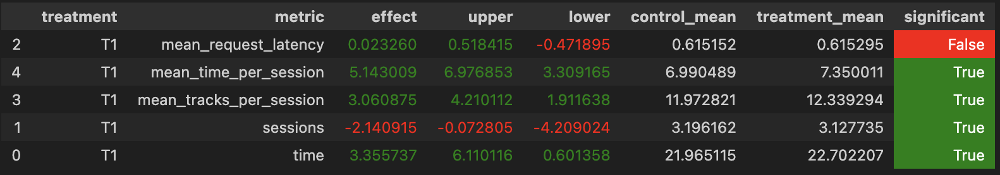

## Homework 2 Report

### Abstract

Исследуется двухэтапный подход к рекомендации треков: сначала с помощью ALS-модели строится кандидатный список с высоким recall@50, затем кандидаты переранжируются c помощью алгоритма LambdaMART(есть готовая реализация как lambdarank в LightGBM). Переранжирование нужно, чтобы поднять NDCG@10 и , как следствие, RECALL@10.

---

### Детали реализации

**Данные и сплит.** Датасет — история прослушиваний (примерно 9 500 пользователей, примерно 14 250 треков). Веса взаимодействий — нормированное время прослушивания (`time > 0.7`). Тестовая выборка: последние 2 трека в сессии(сессии длиной <3 не рассматриваются) каждого пользователя; всё остальное — обучение.

**Пайплайн двух этапов:**

```
Прослушивания пользователя
        │
        ▼
  [ALS, 256 факторов]  ──── user-item матрица (веса = время прослушивания)
        │
        ▼
  similar_items(last_item, N=50)  ──── кандидатный список
        │
        │
        ▼                                                
  [LambdaRank (LightGBM)]
признаки: als_score, als_rank, item_freaquency, item_avg_time, last_item_frequency, user_history_len
                │
                ▼
        переранжированный top-10
```

Ранкер обучается на 80% пользователей, валидируется на 20%. Метка релевантности — позиционный балл из тестового списка (`len(y_rel) - i`). То есть первый трек в истории теста релевантность 3 потом 2 далее 1 все остальное 0.

---

### Результаты A/B-эксперимента

Провел A/B тест на своем **als_lambdarank_i2i.jsonl** файле как HALF_HALF с SAS4Rec, получил 



Можно видеть, что статистически значимо увеличилось **среднее время сессий**(средний прирост эффекта ~5%), **среднее кол-во треков за сессию**(средний прирост эффекта ~3%) и **время**(средний прирост эффекта ~3.5%). В то же время значимо упало ~2% **количество сессий**.
